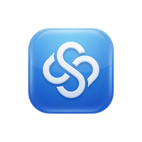
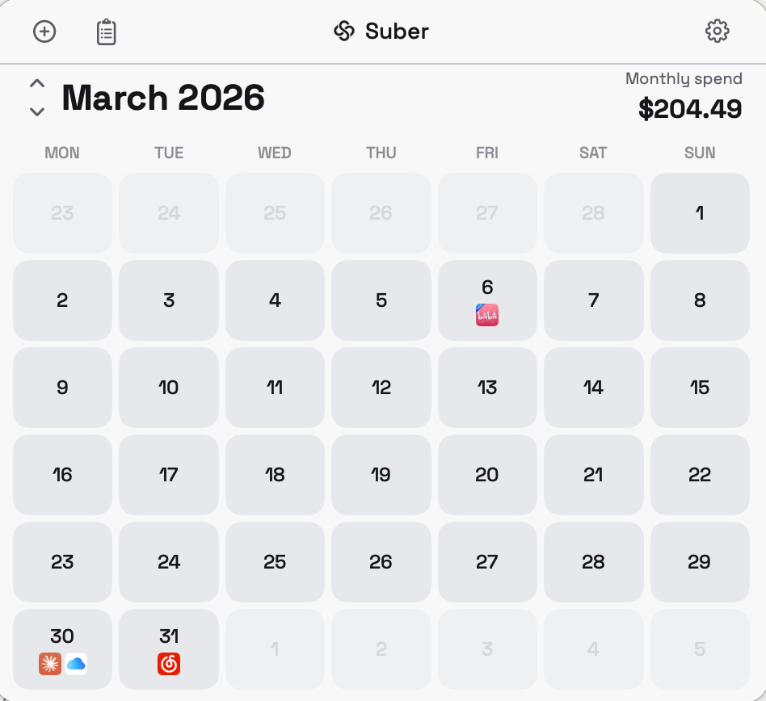
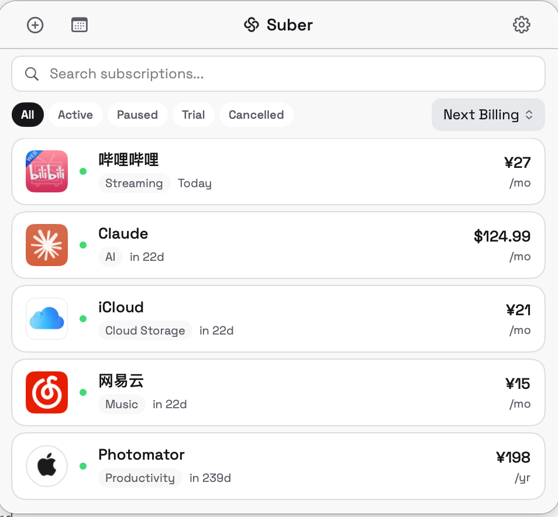
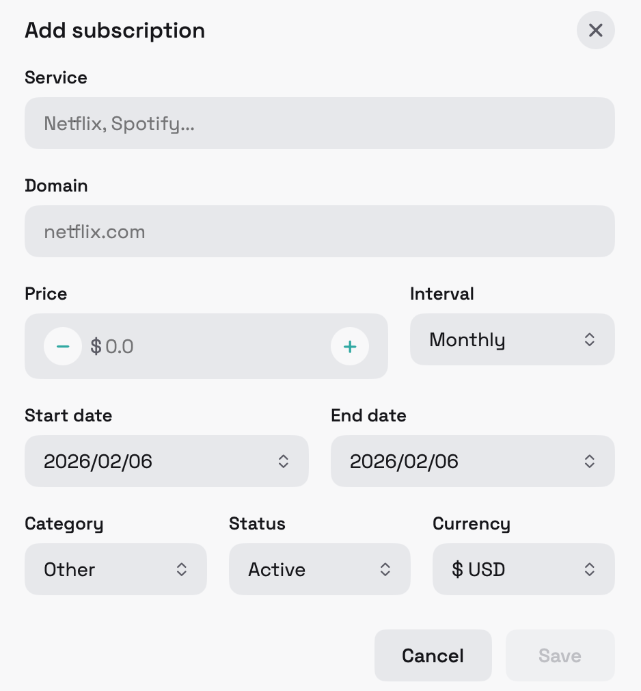

<p align="center">
  
</p>

<h1 align="center">Suber</h1>

<p align="center">
  A native macOS menu bar app for tracking and managing your subscriptions.<br>
  Built with Swift + SwiftUI.
</p>

<p align="center">
  Companion to the <a href="https://github.com/createpjf/subreminder">Suber Chrome Extension</a>
</p>

## Features

- **Menu bar app** — lives in the macOS menu bar, always one click away
- **Calendar view** — visual monthly calendar with animated month transitions and billing date indicators
- **List view** — searchable, filterable, sortable subscription list
- **Smart favicon caching** — 3-tier image cache (memory → disk → network) for fast icon loading
- **Light / Dark mode** — follows system appearance automatically
- **Chrome extension sync** — import subscriptions exported from the Chrome extension
- **Multi-currency** — supports 20+ currencies (USD, EUR, CNY, JPY, etc.)
- **Notifications** — configurable reminders before billing dates
- **Data export / import** — JSON backup and restore
- **Custom typography** — Space Grotesk font throughout the UI

## Screenshots

<p align="center">
  
  &nbsp;
  
  &nbsp;
  
</p>

## Requirements

- macOS 14.0 (Sonoma) or later
- Apple Silicon or Intel Mac

## Installation

### Download DMG

Download the latest `Suber-v1.0.0.dmg` from [Releases](../../releases), open it, and drag `Suber.app` to `Applications`.

> **Note:** The app is ad-hoc signed. On first launch, right-click the app → Open → Open to bypass Gatekeeper.

### Build from Source

```bash
# Clone
git clone https://github.com/createpjf/subreminder-macos.git
cd subreminder-macos

# Install xcodegen (if not installed)
brew install xcodegen

# Generate Xcode project
xcodegen generate

# Build Release
xcodebuild build -project SubReminder.xcodeproj -scheme SubReminder -configuration Release -derivedDataPath .build

# The app is at .build/Build/Products/Release/SubReminder.app
```

### Build DMG

```bash
# After building, create DMG
DMG_DIR=$(mktemp -d)
cp -R .build/Build/Products/Release/SubReminder.app "$DMG_DIR/Suber.app"
ln -s /Applications "$DMG_DIR/Applications"
hdiutil create -volname "Suber" -srcfolder "$DMG_DIR" -ov -format UDZO Suber-v1.0.0.dmg
```

## Import from Chrome Extension

1. In the Chrome extension, go to Settings → Export JSON
2. In the macOS app, go to Settings → Import JSON
3. Select the exported file — subscriptions and settings will be imported

## Tech Stack

- Swift 5.9+, SwiftUI, macOS 14+
- `MenuBarExtra` with `.window` style
- `UserDefaults` + `Codable` JSON persistence
- `NSCache` + disk cache for favicon images
- `xcodegen` for project generation
- Space Grotesk custom font family

## Project Structure

```
Sources/
├── SubReminderApp.swift              # App entry point (MenuBarExtra)
├── Info.plist                        # App configuration
├── Models/
│   ├── Constants.swift               # Theme, AppFont, currencies, categories
│   ├── Settings.swift                # AppSettings model
│   └── Subscription.swift            # Subscription model & form data
├── Services/
│   ├── BillingCalculator.swift       # Next billing date calculations
│   ├── ImageCache.swift              # 3-tier favicon cache (memory/disk/network)
│   ├── NotificationService.swift     # Local notification scheduling
│   └── StorageService.swift          # JSON persistence & import/export
├── Utilities/
│   ├── CurrencyFormatter.swift       # Currency display formatting
│   └── DateHelpers.swift             # Calendar grid & date formatting
├── ViewModels/
│   ├── SettingsStore.swift           # Settings state management
│   └── SubscriptionStore.swift       # Subscription CRUD operations
├── Views/
│   ├── MenuBarView.swift             # Root view with tab navigation
│   ├── TopBarView.swift              # Navigation bar with Suber branding
│   ├── CalendarView.swift            # Monthly calendar with slide animation
│   ├── CalendarDayCellView.swift     # Calendar day cell with billing dots
│   ├── DayDetailView.swift           # Day detail popup
│   ├── ListView.swift                # Subscription list with sort/filter
│   ├── SubCardView.swift             # Subscription card component
│   ├── SubscriptionFormView.swift    # Add/edit subscription form
│   ├── SettingsView.swift            # Settings page
│   └── Components/
│       ├── FilterBarView.swift       # Status filter tabs
│       ├── LogoView.swift            # Favicon with cache integration
│       ├── SearchBarView.swift       # Search input
│       └── ToggleRow.swift           # Toggle setting row
└── Resources/
    └── Fonts/                        # Space Grotesk TTF files
Assets.xcassets/
├── AppIcon.appiconset/               # macOS app icon (blue S-knot)
└── MenuBarIcon.imageset/             # Menu bar template icon
Tests/
├── BillingCalculatorTests.swift
├── StorageServiceTests.swift
└── SubscriptionStoreTests.swift
```

## License

MIT
