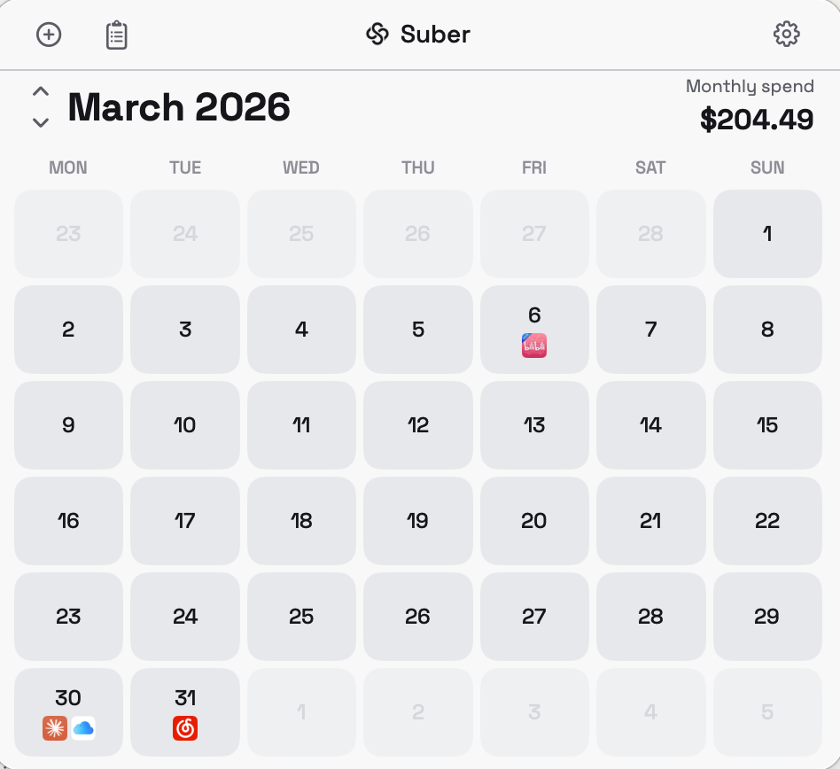
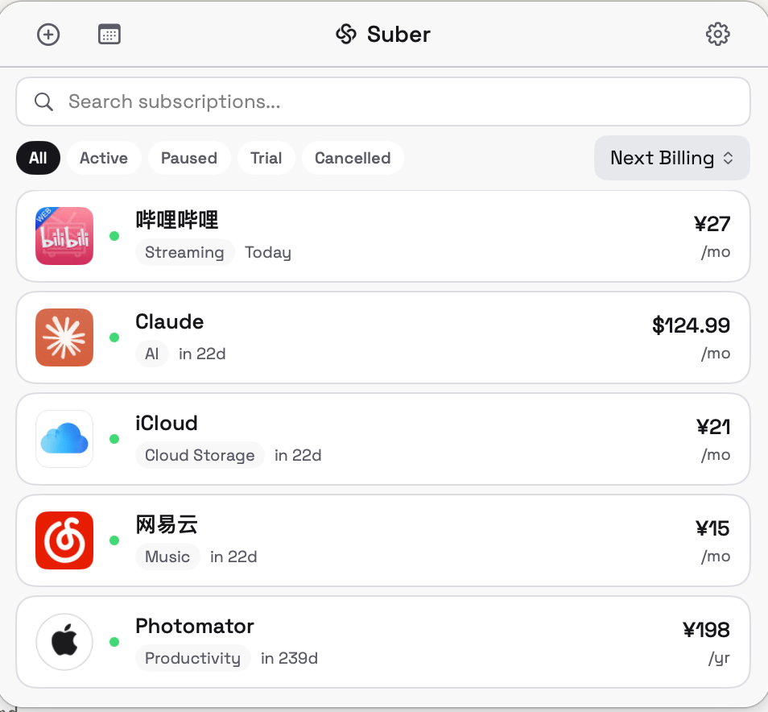
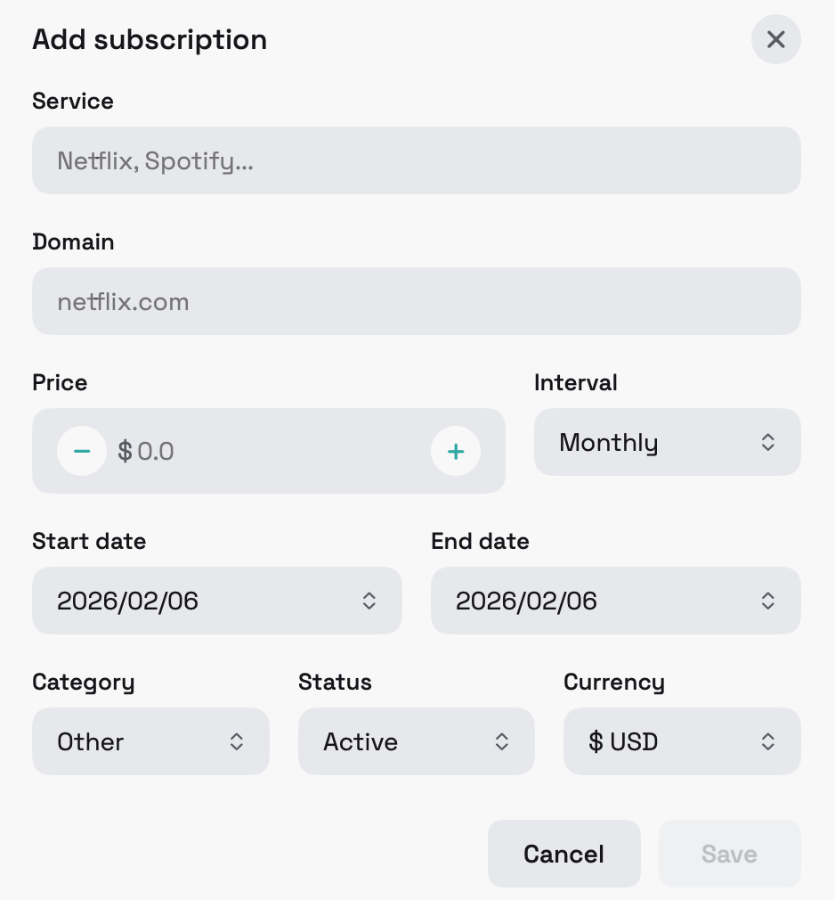

<p align="right">
  <b>English</b> · <a href="./README.zh.md">中文</a>
</p>

<p align="center">
  
</p>

<h1 align="center">Suber</h1>

<p align="center">
  A native macOS menu-bar app for tracking your subscriptions.<br>
  Built with Swift and SwiftUI.
</p>

<p align="center">
  <a href="https://github.com/createpjf/suber-macos/blob/main/LICENSE"></a>
  <a href="https://github.com/createpjf"></a>
  <a href="https://twitter.com/createpjf"></a>
  
  
</p>

## About

Suber lives in your macOS menu bar and tracks every subscription you pay for — Netflix, iCloud, ChatGPT, that forgotten gym app — so renewal dates and total monthly spend are always one click away. Works across all your Macs with iCloud sync, speaks 20+ currencies, speaks English + 简体中文, and doesn't send your data anywhere.

**v1.6.0 — Autopilot** — Suber now works in the background. Watch reads billing receipts from Apple Mail, Sense flags price rises and new subs you forgot about, Act opens the cancel page in one tap and confirms the cancellation actually went through. See the [Autopilot section](#autopilot-watch--sense--act) below.

<p align="center">
  
  &nbsp;
  
  &nbsp;
  
</p>

## Features

### Autopilot (v1.6) — Watch · Sense · Act

- **📬 Mail Watchdog** — opt in once, Suber reads renewal / invoice / trial-ending emails from Apple Mail in the background. Daily scan via `NSBackgroundActivityScheduler`. Privacy: only amounts and dates persist; raw email bodies never reach disk.
- **🔔 Change Sentinel** — flags price rises, new subs you forgot about, and duplicate charges. Menu-bar badge shows the unread count; one grouped notification per scan. Decision-prompt rows surface the delta % and annual impact so you act in seconds, not minutes.
- **✂️ One-Tap Cancel** — built-in cancel-URL map for 40+ services (Netflix, Spotify, ChatGPT, iCloud+, 爱奇艺, …). Suber opens the cancel page in your browser, you cancel there, then Suber verifies on the next billing day and tells you "Netflix cancelled — you'll save $215/year." If the cancel didn't take, you get a clear "Netflix didn't cancel — still active" warning instead of a silent loss.

### Daily-driver basics

- **Menu-bar app** — always one click away, never in your Dock
- **Calendar view** — monthly grid with billing-date indicators, per-day detail popup, pending-cancel countdown
- **List view** — searchable across name / category / URL / notes, sortable by next bill / name / amount / date added, filterable by status
- **Dashboard** — headline monthly spend, 6-month trend chart, category breakdown, top subscriptions
- **Widgets** — small (monthly spend) and medium (upcoming bills) home-screen widgets
- **iCloud sync** — subscriptions, settings, and the v1.6 Autopilot change log stay in sync across Macs
- **Multi-currency** — 20+ currencies with automatic exchange-rate conversion
- **Image auto-fill** — drop a receipt or email screenshot into the add form; Vision-based OCR extracts the name and price
- **Bank-CSV import** — Alipay / WeChat Pay / generic CSV → recurring-charge detection
- **Bilingual** — English + 简体中文 (auto-selects from your macOS Preferred Languages)
- **Siri / App Intents** — "Add a Netflix subscription", "What's my monthly spend"
- **Notifications** — local reminders 1 / 2 / 3 / 5 / 7 days before each bill, configurable
- **JSON export / import** — local backup and restore; also imports from the Suber Chrome extension
- **Light / dark** — follows system appearance
- **Typography** — ships with Space Grotesk

## Install

Grab the latest `Suber-X.Y.Z.dmg` from the [latest release](../../releases/latest), mount it, and drag **Suber.app** into **Applications**. Launch from Applications.

Builds are signed with a Developer ID certificate and notarized by Apple — Gatekeeper lets them open directly, no right-click-workaround needed.

> Requires macOS 14 (Sonoma) or later. Current builds are Apple Silicon only.

## Build from source

```bash
git clone https://github.com/createpjf/suber-macos.git
cd suber-macos

brew install xcodegen
xcodegen generate

xcodebuild build \
  -project Suber.xcodeproj -scheme Suber -configuration Release \
  -derivedDataPath .build
# Product at .build/Build/Products/Release/Suber.app
```

The `scripts/build-dmg.sh` script wraps build + DMG packaging for local testing. Proper distribution additionally requires a Developer ID Application certificate and Apple notarization (see Apple's *Notarizing macOS Software Before Distribution*).

> **Note**: `xcodegen generate` regenerates `Suber.xcodeproj` from `project.yml` and won't preserve any provisioning profile or signing identity selections you've made in Xcode. After regenerating, reopen the project in Xcode and re-select your team in **Signing & Capabilities**.

## Project structure

```
Sources/
├── SuberApp.swift                     # App entry (MenuBarExtra + URL scheme)
├── Info.plist
├── Models/
│   ├── Constants.swift                # Theme, AppFont, currencies, categories
│   ├── KnownServices.swift            # Recognized service metadata
│   ├── Settings.swift
│   └── Subscription.swift
├── Services/
│   ├── BillingCalculator.swift        # Next-billing-date logic
│   ├── CloudSyncService.swift         # iCloud Key-Value Store sync
│   ├── ExchangeRateService.swift      # FX rates for multi-currency
│   ├── HotkeyService.swift            # (dormant) global shortcut
│   ├── ImageCache.swift               # Memory / disk / network favicon cache
│   ├── ImageRecognitionService.swift  # Vision-based OCR for receipt drop-zone
│   ├── NotificationService.swift      # Local reminders
│   ├── StorageService.swift           # JSON persistence + export/import
│   ├── SubscriptionTextParser.swift
│   ├── UpdateService.swift            # GitHub release check
│   └── URLSchemeHandler.swift         # suber:// deep links
├── Intents/
│   ├── AddSubscriptionIntent.swift    # Siri / Shortcuts
│   └── GetSpendIntent.swift
├── Utilities/
│   ├── CurrencyFormatter.swift
│   └── DateHelpers.swift
├── ViewModels/
│   ├── DashboardViewModel.swift
│   ├── SettingsStore.swift
│   └── SubscriptionStore.swift
└── Views/
    ├── MenuBarView.swift              # Root tab container
    ├── TopBarView.swift
    ├── CalendarView.swift
    ├── CalendarDayCellView.swift
    ├── DayDetailView.swift
    ├── DashboardView.swift
    ├── ListView.swift
    ├── SubCardView.swift
    ├── SubscriptionFormView.swift
    ├── SettingsView.swift
    └── Components/
        ├── EmailParseView.swift
        ├── FilterBarView.swift
        ├── ImageDropZoneView.swift
        ├── LogoView.swift
        ├── SearchBarView.swift
        └── ToggleRow.swift

SuberWidget/
├── SuberWidget.swift                  # Widget bundle entry
├── SmallSpendWidget.swift
├── MediumUpcomingWidget.swift
└── WidgetDataProvider.swift

Assets.xcassets/
├── AppIcon.appiconset/
└── MenuBarIcon.imageset/

Tests/
├── BillingCalculatorTests.swift
├── StorageServiceTests.swift
└── SubscriptionStoreTests.swift
```

## Tech stack

- **Swift 5.9 · SwiftUI · macOS 14+**
- **`MenuBarExtra`** with `.window` style for the popover UI
- **`WidgetKit`** for home-screen widgets
- **`App Intents`** for Siri and Shortcuts integration
- **`NSUbiquitousKeyValueStore`** for iCloud sync
- **`Vision` + `CoreImage`** for receipt / screenshot OCR
- **`UserDefaults` + `Codable`** for JSON persistence
- **`NSCache` + disk cache** for favicon images (3-tier: memory → disk → network)
- **URL scheme** (`suber://`) for deep links
- **`xcodegen`** for project generation from `project.yml`
- **Space Grotesk** custom font

## Author

**createpjf** — [@createpjf](https://twitter.com/createpjf)

Companion to the [Suber Chrome Extension](https://github.com/createpjf/suber).

## License

[MIT](LICENSE) © createpjf
